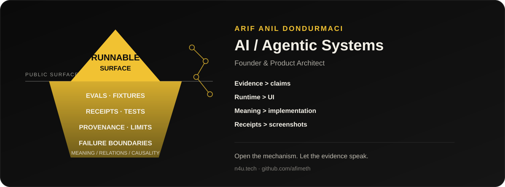

<p align="center">
  
</p>

# Arif Anıl Dondurmacı

**Founder & Product Architect — AI / Agentic Systems**

I work on the parts of AI systems that matter after the demo: durable state, failure recovery, evals, scoped tools, provenance, routing, and evidence-bound execution.

I am building **New4U / Orkestral** privately — [n4u.tech](https://n4u.tech).  
The public repositories here are **not product mirrors**. They are deliberately smaller, inspectable engineering surfaces: runnable mechanisms, synthetic fixtures, tests, receipts, references, and explicit limitations.

> **Open the mechanism, not the mythology.**

English · [Türkçe](README.tr.md)

## Public evidence

- **[agent-runtime-recovery-lab](https://github.com/afimeth/agent-runtime-recovery-lab)** — durable dispatch markers, conservative crash recovery, replay suppression.
- **[evidence-rag-eval-lab](https://github.com/afimeth/evidence-rag-eval-lab)** — deterministic retrieval evaluation, citation binding, abstention and adversarial fixtures.
- **[scoped-tool-gateway-lab](https://github.com/afimeth/scoped-tool-gateway-lab)** — scoped capability gates, expiry, budgets, denial audit and replay tests.
- **[workflow-runtime-oss-lab](https://github.com/afimeth/workflow-runtime-oss-lab)** — Go DAG runtime, bounded concurrency, explicit retry semantics and journal recovery.
- **[durable-backend-systems-lab](https://github.com/afimeth/durable-backend-systems-lab)** — transactional idempotency, atomic outbox behavior and crash-safe backend fixtures.
- **[realtime-product-systems-lab](https://github.com/afimeth/realtime-product-systems-lab)** — async product-state and realtime behavior.
- **[solidity-multichain-security-lab](https://github.com/afimeth/solidity-multichain-security-lab)** — Solidity / multichain security fixtures and invariant-oriented tests.
- **[design-engineering-product-lab](https://github.com/afimeth/design-engineering-product-lab)** — product-facing implementation example.
- **[software-interview-portfolio](https://github.com/afimeth/software-interview-portfolio)** — engineering evidence index across the public labs.

## How I want these repositories read

```text
claim
  -> implementation
  -> fixture / input
  -> test / eval
  -> observed output / receipt
  -> limitation
```

The README is only the tip of the iceberg. Engineers can descend into fixtures, failure cases, receipts, provenance, chronology, and architecture as far as useful.

A runtime does not need a bundled UI to be inspectable:

```text
input -> headless runtime -> output -> receipt
```

CLI, IDE, web, desktop, and automation surfaces are interchangeable projections over the runtime contract.

## Working principles

```text
evidence > claims
runtime > UI
meaning > implementation
receipts > screenshots
explicit limits > polished certainty
```

Human input may be compressed, multilingual, or informal. I prefer preserving source meaning, then projecting it into the representation that best fits the current consumer: English, structured JSON/YAML, Go-like syntax, graph/AST forms, compact relay languages, or model-specific encodings.

**One semantic object, many valid encodings.**

## Tools I use

Python · Go · TypeScript / React · Kotlin / Jetpack Compose · Flutter / Dart · SQLite / PostgreSQL · Docker · local and cloud model runtimes

## Contact

[n4u.tech](https://n4u.tech) · [GitHub](https://github.com/afimeth) · [LinkedIn](https://www.linkedin.com/in/arif-anil-dondurmaci-0a8067160/) · [Email](mailto:anildondurmaci2@gmail.com)
